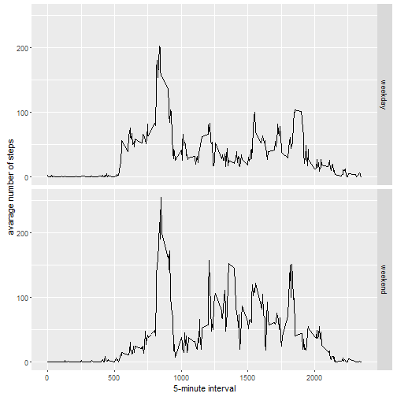

# Reproducible Research: Peer Assessment 1


## Loading and preprocessing the data
Load the activity data and transform the data


```r
if(!file.exists('activity.csv')){
    unzip('activity.zip')
}
activityData <- read.csv('activity.csv',colClasses = c("integer", "Date", "integer"))
str(activityData)
```

```
## 'data.frame':	17568 obs. of  3 variables:
##  $ steps   : int  NA NA NA NA NA NA NA NA NA NA ...
##  $ date    : Date, format: "2012-10-01" "2012-10-01" ...
##  $ interval: int  0 5 10 15 20 25 30 35 40 45 ...
```

## What is mean total number of steps taken per day?

Make a histogram of the total number of steps taken each day

```r
activityData_rm <- activityData[which(!is.na(activityData$steps)),]
activityByDay <- tapply(activityData_rm$steps,activityData_rm$date, sum, na.rm=TRUE)
qplot(activityByDay, xlab='Total steps per day', ylab='Frequency using binwith 500', binwidth=500)
```


Calculate and report the Mean and Median of the total number of steps taken per day

```r
mean(activityByDay)
```

```
## [1] 10766.19
```

```r
median(activityByDay)
```

```
## [1] 10765
```


## What is the average daily activity pattern?

Make a total number of steps taken interval

```r
activityByInterval <- aggregate(x=list(steps=activityData_rm$steps), by=list(interval=activityData_rm$interval), FUN=mean, na.rm=TRUE)
```

Make a time series plot

```r
ggplot(data=activityByInterval, aes(x=interval, y=steps)) +
        geom_line() +
        xlab("5-minute interval") +
        ylab("average number of steps taken")
```


The interval with the maximum average number of steps 

```r
activityByInterval[which.max(activityByInterval$steps),]
```

```
##     interval    steps
## 104      835 206.1698
```

## Imputing missing values

Missing values in the dataset

```r
sum(is.na(activityData$steps))
```

```
## [1] 2304
```

Create a new dataset that is equal to the original dataset but with the missing data filled in.

```r
activityDataImputed <- activityData
for (i in 1:nrow(activityDataImputed)) {
    if (is.na(activityDataImputed$steps[i])) {
        activityDataImputed$steps[i] <- activityByInterval[which(activityDataImputed$interval[i] == activityByInterval$interval), ]$steps
    }
}
sum(is.na(activityDataImputed$steps))
```

```
## [1] 0
```

Make a histogram of the total number of steps taken each day

```r
activityByDayImputed <- tapply(activityDataImputed$steps, activityDataImputed$date, sum)
qplot(activityByDayImputed, xlab='Total steps per day (Imputed)', ylab='Frequency using binwith 500',binwidth=500)
```


Calculate the mean and median total number of steps taken per day

```r
mean(activityByDayImputed)
```

```
## [1] 10766.19
```

```r
median(activityByDayImputed)
```

```
## [1] 10766.19
```

The impact of inputting missing data is minimal, as only the median seems to be changing but by just over one step.

```r
mean(activityByDayImputed)-mean(activityByDay)
```

```
## [1] 0
```

```r
median(activityByDayImputed)-median(activityByDay)
```

```
## [1] 1.188679
```

## Are there differences in activity patterns between weekdays and weekends?

Create a new factor variable in the dataset 

```r
activityDataImputed$dateType <-  ifelse(as.POSIXlt(activityDataImputed$date)$wday==5 | as.POSIXlt(activityDataImputed$date)$wday==6, 'weekend', 'weekday')
```

Make a panel plot containing a time series plot

```r
averagedActivityDataImputed <- aggregate(steps ~ interval + dateType, data=activityDataImputed, mean)
ggplot(averagedActivityDataImputed, aes(interval, steps)) + 
    geom_line() + 
    facet_grid(dateType ~ .) +
    xlab("5-minute interval") + 
    ylab("avarage number of steps")
```


